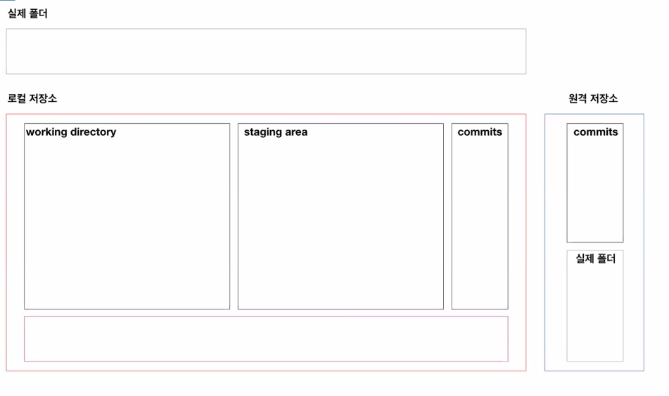

# git 기초

> 분산 버전 관리 시스템(DVCS)

## 로컬 저장소(repository) 설정

```bash
$ git init
Initialized empty Git repository in C:/Users/user/Desktop/정리/.git/

//결과도 같이 저장하는게 좋다

(master) $
```

* `.git` 폴더가 생성되고, 여기에 git과 관련된 모든 정보들이 저장된다.


## 기본 작업 흐름

모든 작업은 `touch`명령어를 통해서 파일을 만드는 것으로 대체

### 1. `add`

```bash
$ git add __디렉토리__
$ git add a.txt # 특정 파일
$ git add my_folder	# 특정 폴더
$ git add a.txt b.txt # 특정 파일들
$ git add . # 현재 디렉토리(하위 디렉토리 포함)
```

* 커밋 대상 파일 목록에 추가한다.
* working directory 의 변경사항(첫번째 통)을 staging area(두번째 통) 상태로 변경시킨다.

#### add 이전

```bash
$ touch new.txt
$ git status
On branch master

No commits yet
# tracking X 파일들 
# git으로 관리된 적이 없는 파일 (새로 만든 파일 등)
Untracked files:
	# 포함시키기 위해서는 git add 명령어를 사용..
	# 커밋이 될 것
	# => 두번째 통(staging area)에 담기 위해서..
  (use "git add <file>..." to include in what will be committed)
  # 파일 목록
        new.txt

# staging area에는 X, WD 에는 O
nothing added to commit but untracked files present (use "git add" to track)

```


### add 이후

```bash
$ git add .
$ git status
On branch master

No commits yet
# 변경사항들.. 커밋됨
# Staging area O
Changes to be committed:
  (use "git rm --cached <file>..." to unstage)
        new file:   new.txt


```


### 2. commit

```bash
$ git commit -m 'Add new.txt'
[master (root-commit) f1a35c9] Add new.txt
 1 file changed, 0 insertions(+), 0 deletions(-)
 create mode 100644 new.txt
```


* `commit` 지금 파일 상태를 스냅샷
* 커밋 메세지는 코드 변경사항(이력/버전/커밋)
* 아래의 명령어를 통해서 지금까지 기록된 커밋을 확인할 수 있따다.


### log

```bash
$ git log
commit f1a35c9bfdc0cd5a724159be1da978b8d13285e6 (HEAD -> master)
Author: kim3278 <ksem1903@naver.com>
Date:   Tue Mar 16 15:09:04 2021 +0900

    Add new.txt

$ git log --oneline
f1a35c9 (HEAD -> master) Add new.txt

$ git log -1 #최근 1개의 log
$ git log --oneline -1
```


### blank



